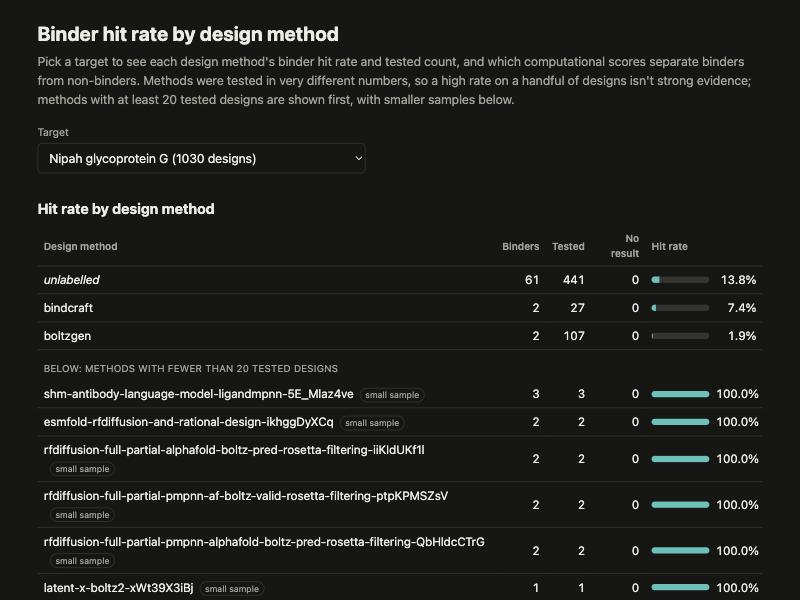

# proteinbase-data

A small dashboard on top of [Proteinbase](https://proteinbase.com), Adaptyv Bio's open dataset of
protein binder designs (CSV snapshot of 28 Jan 2026). For a chosen target — mainly Nipah
glycoprotein G and EGFR, the two with real sample sizes — it shows each design method's binder hit
rate, and which computational scores (Boltz-2, ESMFold) actually separate binders from
non-binders.



<!--
  TODO (you, not me): replace this paragraph with your own couple of sentences — why you built
  this, what you were curious about, what surprised you in the data. I drafted the rest of this
  README factually, but this part should be in your own words before you link it anywhere.
-->

Designs with no method label are shown as **unlabelled** rather than dropped, and methods tested
on fewer than 20 designs are flagged and sorted separately — most of Proteinbase's 2,630 binding
results are concentrated in a handful of methods, and a 100% hit rate on two or three designs
isn't evidence of anything. Out of scope: ordering experiments, paid API calls, structure viewers,
user accounts.

## Data source and licence

The data is the open Proteinbase dataset. **Credit: Adaptyv Bio and Proteinbase.** It is licensed
under [ODC-By](https://opendatacommons.org/licenses/by/1-0/); any use or redistribution must keep
this credit. The dashboard shows the credit, licence and snapshot date on every view.

## Getting the data

The raw CSV is **not committed** to this repository (`data/` and `*.csv` are git-ignored).

1. Download the all-data CSV from the Proteinbase download page,
   <https://proteinbase.com/download>. This project was built and verified on the snapshot of
   28 Jan 2026 (`proteinbase_all_data_28_01_2026.csv`, about 40 MB, 5,253 rows); a newer export
   may have different counts.
2. Put it in the `data/` folder of this repository.

The file is UTF-8 with a byte-order mark, with columns `id`, `name`, `sequence`, `author`,
`designMethod` and `evaluations` (a JSON array of experimental and computational evaluations).

## Run

Requires Docker with Compose.

```bash
cp .env.example .env   # then set POSTGRES_PASSWORD in .env (git-ignored)
docker compose up -d --build
docker compose run --rm backend python -m src.ingest /data/proteinbase_all_data_28_01_2026.csv
```

Open <http://localhost:5173>. The ingest prints how many rows were read, how many distinct
(design, target) pairs were found, and how many were conflicting; running it again replaces the
snapshot with identical results. Until the ingest has run, the dashboard shows a message saying no
data is loaded.

The frontend container runs the Vite server, which proxies `/api` to the backend. For a public
deployment put a production build and a reverse proxy in front instead.

## How numbers are defined

- **Binder** = the dataset's own boolean `binding` result for that design and target. Repeated
  evaluations for the same pair count once; pairs whose evaluations disagree (13 in this snapshot)
  count as "no result", which is listed but left out of the hit rate.
- **Hit rate** = binders ÷ designs with a clear binder or non-binder result, per design method.
- Scores use the dataset's numeric computational metrics. A score with a target applies only to
  that target. Where a design has several *different* recorded values for the same score, that design is left
  out of that score's distributions and counted. The one exception is ESMFold pLDDT, which most
  designs have two or more values for (we do not know why): values within 5 points of each other
  are averaged, and a wider gap counts as conflicting and is excluded. Designs with no
  value for a score are likewise counted and reported, not silently dropped.
- Any method or group with fewer than 20 designs is flagged as a **small sample**.

## Development

```bash
cd backend && uv sync && uv run pytest        # unit tests (flattening, hit rate, distributions)
cd frontend && npm install && npm run dev     # frontend on :5173 (needs the API on :8000)
```

Specs and plan live in `specs/001-binder-hit-rate-dashboard/`.
